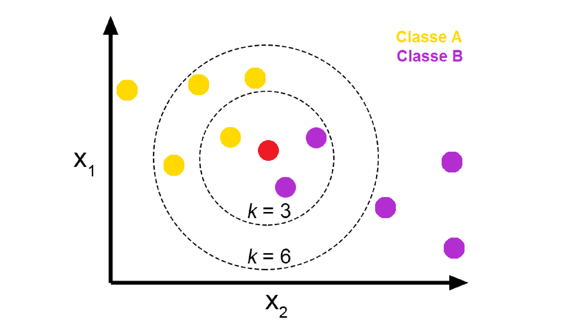
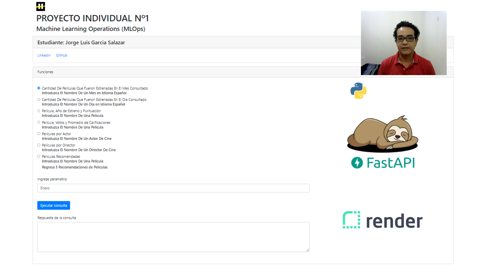
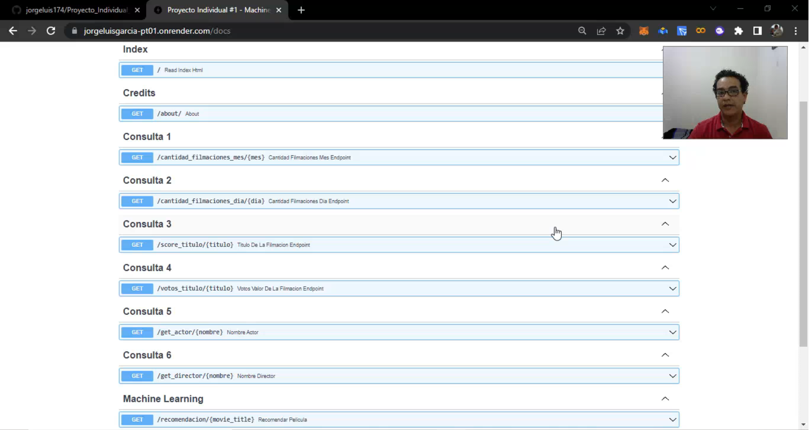

# PROYECTO INDIVIDUAL Nº1 - Machine Learning Operations

#### Desarrollado por: Jorge Luis Garcia

###### Estudiante de la carrera "DATA SCIENCE"

---

¡Bienvenido(a) al proyecto de Ciencia de Datos!

Este proyecto tiene como objetivo utilizar dos conjuntos de datos relacionados con películas y actores, llamados "movies_dataset" y "credits". A lo largo del proyecto, abordaremos tareas como ETL, EDA, Machine Learning y el despliegue de una aplicación.

## Enunciado del Proyecto

> *Comenzaste a trabajar como Data Scientist en una start-up que provee servicios de agregación de plataformas de streaming. Tu primer objetivo es crear un sistema de recomendación que aún no ha sido puesto en marcha. Sin embargo, te enfrentas a un desafío: los datos son poco maduros y requieren un proceso de limpieza y transformación.*

> *El proyecto abarcará desde el tratamiento y recolección de datos (tareas de Data Engineer) hasta el entrenamiento y mantenimiento del modelo de Machine Learning a medida que lleguen nuevos datos.*

# Diccionario de Carpetas y Archivos En Repositorio

```python
project_folders = {
    "data": "En esta carpeta se guardan los archivos descomprimidos del archivo data_1.0.2",

    "EDA": "Esta carpeta contiene un archivo en formato .ipynb que se utilizó para realizar el análisis
	exploratorio de los datos.",

    "EDA/data_a_explorar": "Contiene el archivo con el que se realizó el análisis exploratorio de los datos.",

    "ETL": "Contiene 9 carpetas que incluyen procesos de transformación y limpieza de datos, tratamiento de
	columnas anidadas, sustitución de valores nulos, revisión de tipos de datos y códigos para eliminar
	valores repetidos o con formatos distintos a los que corresponden en su columna.",

    "ETL/1-Arquitectura_Nuevos_DataSets": "Contiene un archivo en formato .ipynb en el que se realizó la
	separación del dataset original y se crearon nuevos datasets. Para más detalles, revisar el
	diccionario de datos.",

    "ETL/6-DataSets_Final_movies_dataset": "Contiene un archivo en formato .zip en el que se encuentran
	comprimidos los archivos limpios.",

    "ETL/7-Datasets_original": "Contiene los archivos originales comprimidos en un archivo .zip.",

    "ETL/9-Proceso_ETL_credits": "Contiene dos archivos en formato .ipynb donde se realiza el proceso
	ETL del archivo credits.csv.",

    "Machine_Learning/Pruebas": "Contiene un archivo en formato .ipynb en el que se desarrolló la función
	para crear un modelo de aprendizaje utilizando el método 'vecinos más cercanos'.",

    "Scripts": "Contiene archivos relacionados con el entorno virtual"

    "data_1.0.2.zip": "Archivo comprimido en formato .zip que contiene la data limpia.",

    "index.html": "Archivo con el código en HTML, JavaScript y CSS que se utilizó para crear el Frontend.",

    "main.py": "Archivo que contiene todo el código de la API desarrollada con FastAPI.",

    "requirements.txt": "Archivo útil para realizar el despliegue en Render."
}

```

# Reseña de Habilidades Blandas Aplicadas en el Proyecto

Durante el desarrollo de este proyecto, pude aplicar una variedad de habilidades blandas que resultaron fundamentales para su éxito.

Trabajar en este proyecto de forma independiente me permitió demostrar mi autonomía, organización y capacidad para resolver problemas de manera efectiva.

Para mantener un seguimiento ordenado de las tareas y garantizar una gestión eficiente del proyecto, utilicé herramientas como Trello, lo que me permitió establecer metas, asignar plazos y priorizar las actividades de manera adecuada.


Además, me apoyé en mi habilidad de comunicación escrita, utilizando el formato de comentarios de Google en el código y redactando de manera clara y concisa para facilitar la comprensión de mis ideas.

```python
@app.get("/recomendacion/{movie_title}", tags=['Machine Learning'])
def recomendar_pelicula(movie_title: str):
    """
    Devuelve una lista de las 5 películas recomendadas basadas en una película dada.

    Args:
        movie_title (str): El título de la película.

    Returns:
        dict: Un diccionario con las películas recomendadas como una lista.
    """

    recommended_movies = movie_recommendation(movie_title)
    return {"recommended_movies": recommended_movies.tolist()}

```

A lo largo del proyecto, enfrenté diversos desafíos que requerían de un pensamiento crítico y la capacidad de aprender de manera autodirigida. Investigué soluciones a problemas técnicos y adquirí nuevos conocimientos en el área de Ingeniería de Datos y Machine Learning para poder desarrollar y aplicar modelos de aprendizaje automático de forma efectiva.

En resumen, este proyecto me permitió fortalecer habilidades como la autonomía, la organización, la resolución de problemas, la comunicación escrita, el aprendizaje autodirigido y el pensamiento crítico. Estas habilidades resultaron fundamentales para lograr el éxito en el desarrollo de este proyecto y estoy entusiasmado/a de seguir cultivándolas en futuras oportunidades.

# ETL y EDA

## Exploración y Limpieza de Datos

Después de realizar el proceso de Extracción, Transformación y Carga (ETL) en mi proyecto de Ciencia de Datos, me encontré en una etapa emocionante donde creé nuevos conjuntos de datos con el objetivo de obtener una visión aún más clara y enriquecedora de mis datos.

Durante la exploración y limpieza de los datos iniciales, desanidé campos como `belongs_to_collection` y `production_companies`, lo cual me permitió extraer información relevante que posteriormente utilicé en consultas de la API. Esta nueva información me brindó una visión más detallada sobre las colecciones a las que pertenecen las películas y las compañías de producción involucradas, enriqueciendo así mi análisis.

Además, para garantizar la integridad de mi conjunto de datos, rellené los valores nulos en los campos `revenue` y `budget` con el número 0. Esta acción me permitió manejar adecuadamente los datos faltantes y evitar posibles problemas en etapas posteriores del proyecto.

Asimismo, eliminé los registros con valores nulos en el campo `release date` y aseguré que todas las fechas estén en el formato AAAA-mm-dd. Esta transformación fue esencial para analizar y comparar de manera efectiva las fechas de estreno de las películas.

Para ampliar mis posibilidades de análisis, creé una nueva columna llamada `release_year`, la cual me permitió extraer el año de lanzamiento de cada película. Esta adición me brindó la capacidad de realizar análisis basados en años y observar las tendencias a lo largo del tiempo, brindando una perspectiva temporal valiosa.

Con el objetivo de evaluar el rendimiento financiero de las películas, calculé un nuevo campo llamado `return`, el cual representa el retorno de inversión al dividir los campos `revenue` y `budget`. En casos donde no había datos disponibles para el cálculo, asigné el valor 0. Esta métrica proporcionó información valiosa sobre el rendimiento financiero de las películas, permitiéndome tomar decisiones informadas basadas en datos.

Por último, para simplificar mi conjunto de datos y enfocarme en las variables más significativas para mi proyecto, eliminé las columnas que no eran relevantes, tales como `video`, `imdb_id`, `adult`, `original_title`, `poster_path` y `homepage`. Esta acción me permitió reducir el ruido en mis datos y concentrarme en las características clave que impulsarían mi análisis y resultados.

En resumen, después de completar el proceso de ETL, creé nuevos conjuntos de datos que me proporcionaron una visión más amplia y mejorada de los datos, preparándome para las etapas posteriores del proyecto y brindándome una base sólida para realizar análisis más profundos y reveladores.

## Diccionario de datos

Haber separado los datos en diferentes conjuntos y crear diccionarios de datos para cada uno de ellos ha sido una decisión clave en mi proyecto individual de Ciencia de Datos. Esta estructura organizativa me ha brindado una serie de beneficios importantes.

Al separar los datos en conjuntos específicos, como datasets_final.csv, ML_data.csv, cast_data.csv, crew_data.csv y movie_genres.csv, he logrado una mayor modularidad y claridad en la estructura de mi proyecto. Cada archivo representa un aspecto distinto de los datos y me permite trabajar en cada uno de ellos de manera independiente y centrada en sus características únicas.

El archivo ML_data.csv desempeñó un papel fundamental en mi proyecto de Machine Learning. Las columnas disponibles en este conjunto de datos me proporcionaron la información necesaria para realizar una predicción utilizando el algoritmo de "Vecinos más Cercanos" (K-Nearest Neighbors) en el contexto de Machine Learning. Utilizando estas características, pude entrenar el modelo y hacer predicciones precisas sobre la popularidad de las películas.

El diccionario de datos asociado a datasets_final.csv proporciona descripciones detalladas de cada columna en este conjunto de datos, lo cual es fundamental para comprender la información contenida en él. Al conocer el propósito y el significado de cada columna, puedo tomar decisiones más informadas y realizar análisis más precisos y relevantes.

Del mismo modo, los diccionarios de datos asociados a cast_data.csv, crew_data.csv y movie_genres.csv me permiten entender rápidamente las columnas presentes en cada conjunto de datos y su significado. Esto facilita la manipulación, el procesamiento y la interpretación de los datos en cada contexto específico.

En resumen, la separación de los datos en diferentes conjuntos y la creación de diccionarios de datos específicos para cada uno de ellos ha sido una elección estratégica en mi proyecto individual de Ciencia de Datos. Esta estructura modular y descriptiva me ha permitido realizar análisis más profundos, utilizar el conjunto de datos ML_data.csv para el entrenamiento de un modelo de Machine Learning y realizar predicciones precisas utilizando el algoritmo de "Vecinos más Cercanos" (K-Nearest Neighbors). Además, me ha proporcionado una visión más completa de los diferentes aspectos de las películas, como su información general, elenco, equipo de producción y géneros.

A continuación se muestra un diccionario que describe cada columna en el conjunto de datos del archivo datasets_final.csv:

```python
column_description = {
    'id': 'ID de la película',
    'title': 'Título de la película',
    'overview': 'Descripción de la película',
    'popularity': 'Popularidad de la película',
    'vote_average': 'Promedio de votos de la película',
    'vote_count': 'Número de votos de la película',
    'status': 'Estado de la película',
    'original_language': 'Idioma original de la película',
    'runtime': 'Duración de la película en minutos',
    'budget': 'Presupuesto de la película',
    'revenue': 'Ingresos generados por la película',
    'tagline': 'Lema de la película',
    'id_btc': 'ID de la película en BTC',
    'name_btc': 'Nombre de la película en BTC',
    'poster_btc': 'URL del póster de la película en BTC',
    'backdrop_btc': 'URL del fondo de la película en BTC',
    'iso_639_1': 'Código ISO 639-1 del idioma',
    'language_name': 'Nombre del idioma',
    'release_year': 'Año de lanzamiento de la película',
    'return': 'Relación entre ingresos y presupuesto de la película',
    'companies_id': 'ID de las compañías de producción',
    'companies_name': 'Nombres de las compañías de producción',
    'countries_iso': 'Códigos ISO de los países de producción',
    'countries_name': 'Nombres de los países de producción',
    'release_date': 'Fecha de lanzamiento de la película',
    'month_time': 'Mes en el que se creó la película',
    'day_time': 'Día en el que se creó la película'
}

```

A continuación se muestra un diccionario que describe cada columna en el conjunto de datos del archivo ML_data.csv:

```python
column_description = {
    'id': 'ID de la película',
    'title': 'Título de la película',
    'genero': 'Género de la película',
    'popularity': 'Popularidad de la película'
}

```

A continuación se muestra un diccionario que describe cada columna en el conjunto de datos del archivo cast_data.csv:

```python
column_description = {
    'id': 'ID de la película',
    'cast': 'Elenco de la película en formato JSON'
}
```

A continuación se muestra un diccionario que describe cada columna en el conjunto de datos del archivo crew_data.csv:

```python
column_description = {
    'id': 'ID de la película',
    'crew_credit_id': 'ID de crédito del equipo de producción',
    'crew_department': 'Departamento del equipo de producción',
    'crew_gender': 'Actividad en el equipo de producción',
    'crew_id': 'ID del miembro del equipo de producción',
    'crew_job': 'Trabajo del miembro del equipo de producción',
    'crew_name': 'Nombre del miembro del equipo de producción',
    'crew_profile_path': 'Ruta del perfil del miembro del equipo de producción'
}

```

A continuación se muestra un diccionario que describe cada columna en el conjunto de datos del archivo movie_genres.csv:

```python
column_description = {
    'id': 'ID de la película',
    'id_genres': 'ID de géneros asociados a la película',
    'genero': 'Géneros de la película'
}

```

## Análisis Exploratorio de Datos (EDA)

Después de completar las tareas de limpieza de datos, realicé un análisis exploratorio exhaustivo utilizando técnicas estadísticas y visualizaciones. El archivo donde se llevó a cabo este análisis se encuentra en la carpeta "data_a_explorar", en un notebook que contiene las gráficas de exploración.

Durante el análisis exploratorio, utilicé las siguientes librerías: pandas, numpy, matplotlib.pyplot y seaborn. Estas herramientas me permitieron realizar diversas actividades, como calcular el porcentaje de valores faltantes en cada columna, filtrar las columnas con valores faltantes y examinar variables numéricas como "popularity", "vote_average", "vote_count", "runtime", "budget", "revenue" y "return".

También realicé cálculos de estadísticas descriptivas, como la media, mediana, desviación estándar y percentiles, para comprender la distribución de los datos. Generé histogramas y gráficos de caja para visualizar las variables numéricas, así como un gráfico de dispersión para analizar la relación entre los ingresos y presupuestos de las películas.

Además, realicé diversas visualizaciones para explorar la distribución de películas por mes y año de lanzamiento, los países con mayor producción cinematográfica, los géneros más populares a lo largo del tiempo, entre otros análisis. También generé un mapa de calor para examinar las relaciones entre las variables.

Este análisis exploratorio de datos fue fundamental para obtener conocimientos valiosos que nos ayudaron a comprender mejor el conjunto de datos y a tomar decisiones informadas en etapas posteriores del proyecto. Nos permitió descubrir patrones, identificar outliers y obtener una comprensión más profunda de las características de las películas y su éxito financiero.

# Sistema de Recomendación

## Desarrollo de Modelos de Machine Learning

Además del análisis exploratorio de datos, implemente un modelo de Machine Learning para resolver el siguiente desafío:

* Sistema de recomendación: Utilizamos técnicas de filtrado colaborativo y/o basado en contenido para construir un sistema de recomendación de películas personalizadas.
* Esto permitió a los usuarios descubrir nuevas películas en función de sus preferencias. Mediante la API, los usuarios pueden ingresar el nombre de una película y el endpoint correspondiente les proporcionará 5 recomendaciones basadas en sus características y en las preferencias de otros usuarios con gustos similares. Esto mejora la experiencia del usuario al ofrecer sugerencias relevantes y personalizadas para su disfrute cinematográfico.

## Análisis en el que me basé para utilizar el modelo de aprendizaje automático "k vecinos más cercanos"

Para el desarrollo del sistema de recomendación, se nos proporcionó un enunciado. Cito fracción textual del enunciado: "Este consiste en recomendar películas a los usuarios basándose en películas similares, por lo que se debe encontrar la similitud de puntuación entre esa película y el resto de películas". El enunciado me pide que encuentre la similitud de puntuación entre una película y las demás películas, y naturalmente, lo primero que me viene a la mente para crear el sistema de recomendación es utilizar la función "cosine_similarity".

La función "cosine_similarity" es una medida comúnmente utilizada en el campo de la recuperación de información y la minería de texto para evaluar la similitud entre dos vectores de características. En particular, la similitud del coseno se utiliza con mayor frecuencia para comparar la similitud entre vectores que representan documentos o textos.

Sin embargo, la función "cosine_similarity" tiene algunas limitaciones, y una de las que más llamó mi atención es que opera con vectores de características numéricas. Por lo tanto, si los vectores contienen valores no numéricos o datos no estructurados, es posible que la función no sea aplicable directamente. Esta limitación captó mi atención, pero también hay otras consideraciones, como el espacio vectorial, la longitud y dimensionalidad de los vectores, la sensibilidad a la magnitud, entre otras.

Para poder realizar una mejor predicción en el modelo, no solo podía basarme en la puntuación de la película, ya que existen otros factores importantes y de mucha más relevancia que la puntuación. Un ejemplo de ello es el género de la película. En un caso concreto, puedo mencionar dos películas con altas puntuaciones, pero de géneros totalmente distintos.

Sería absurdo recomendarle a un usuario que acaba de ver "The Shawshank Redemption" (Cadena perpetua), que es un drama carcelario basado en la novela de Stephen King, una película como "The Dark Knight" (El Caballero Oscuro), que es una película de superhéroes y acción basada en el personaje de Batman de DC Comics.

Este incoherencia me llevó a plantearme muchas preguntas, pero las más relevantes fueron las siguientes:

* ¿Qué le gustaría ver al usuario después de ver una película que le ha gustado mucho?
* ¿Realmente querría ver películas con una valoración similar o igual a la que le ha gustado?
* ¿Dónde reside la ganancia real en el negocio de los servicios de streaming pagados?

No podía quedarme con la duda, así que comencé a investigar. En primer lugar, revisé un trabajo de fin de grado de un tal David López Delgado, estudiante de la Universidad de Sevilla, en la facultad de Ciencias Económicas y Empresariales. Su trabajo lleva por título: "ESTUDIO DE LAS PLATAFORMAS DE STREAMING". Este trabajo analiza las principales plataformas de contenido audiovisual bajo demanda de pago que operan en España, tratando su origen, características generales y estrategias de marketing que llevan a cabo.

Por otro lado, también revisé una tesis doctoral de una brillante investigadora llamada Jessica Izquierdo Castillo, de la Universidad de Jaume (España), del departamento de Filosofía y Sociología Comunicacional Audiovisual y Publicidad. La tesis es un poco antigua, pero contiene un valioso contenido informativo. De hecho, si alguien trabaja en una empresa que presta servicios de streaming u otro relacionado con marketing y publicidad, este material sería considerado como un recurso imprescindible. El título de la tesis doctoral es: "Distribución y Exhibición Cinematográfica en España. Un estudio de situación del negocio en la transición tecnológica digital".

Después de informarme mejor a través de estos recursos y otros artículos, he llegado a la conclusión de que, desde el punto de vista comercial y netamente capitalista, a las empresas que prestan servicios de streaming de pago no les interesa realmente recomendarte una película que te vaya a gustar de manera certera. Su objetivo principal es lograr que el usuario consuma contenido en la plataforma.

Estas empresas realizan grandes inversiones en la industria cinematográfica, invirtiendo en grandes empresas que producen películas y desarrollan nuevas tecnologías cinematográficas. También invierten en startups dedicadas al cine, la creación de documentales, series, entre otros.

Estas compañías necesitan recuperar su inversión, y la forma obvia de hacerlo es asegurarse de que los usuarios de estas plataformas consuman la mayor cantidad de contenido posible, sin importar la puntuación de las películas o series que hayan visto.

¿Comprendes mi punto de vista?

Por esta razón, decidí no utilizar la función "cosine_similarity", ya que para realizar recomendaciones se requieren muchos factores no numéricos que son de gran importancia al manipular al usuario y fomentar el consumo generalizado de contenido en una plataforma de streaming de pago.

En su lugar, utilicé el método "k vecinos más cercanos" (KNN) para construir mi modelo. KNN es un algoritmo de aprendizaje automático supervisado que se utiliza para clasificación y regresión. Funciona encontrando los "k" puntos de datos más cercanos en función de una medida de distancia (por ejemplo, distancia euclidiana) y tomando una decisión basada en las etiquetas de clase o los valores de los vecinos más cercanos.

KNN funciona bien con datos estructurados y numéricos, lo cual puede ser adecuado para tu conjunto de datos si tienes columnas como valoración numérica y no numerica. Además, las medidas de distancia utilizadas en KNN se basan en la proximidad espacial de los puntos de datos, lo que puede ser más apropiado para conjuntos de datos numéricos.

KNN es especialmente útil cuando se espera que los puntos de datos similares estén cerca en el espacio de características. Si se espera que las películas con características similares estén cercanas en el espacio de características, KNN podría ser una opción adecuada para encontrar películas similares basándose en sus vecinos más cercanos.

KNN es especialmente útil cuando se espera que los puntos de datos similares estén cerca en el espacio de características. En el caso de datos numéricos, KNN tiene en cuenta la proximidad espacial de los puntos de datos y puede ser una opción adecuada para encontrar películas similares basándose en sus vecinos más cercanos. Esto significa que si una película tiene características numéricas, como la puntuación de los usuarios, KNN puede ser útil para encontrar películas con puntuaciones similares.

Sin embargo, lo interesante de KNN es que también puede aplicarse a conjuntos de datos que contienen información no numérica, como la columna de géneros en el caso de las películas. Aunque el algoritmo se basa en la distancia entre puntos de datos, la representación de los datos en un espacio de características adecuado puede permitir que KNN capture similitudes entre películas con géneros similares.



Por lo tanto, al desarrollar un sistema de recomendación completo y preciso, es importante considerar tanto los aspectos numéricos, como la puntuación de las películas, como los aspectos no numéricos, como el género de las películas. KNN ofrece flexibilidad al trabajar con ambos tipos de datos, lo que lo convierte en una opción interesante para construir un sistema de recomendación que tome en cuenta múltiples factores.

En conclusión, KNN es una buena opción cuando se trabaja con datos numéricos, pero también puede ser utilizado de manera efectiva en conjuntos de datos que contengan información no numérica, como los géneros de las películas. Esto permite construir un sistema de recomendación más completo al considerar tanto las puntuaciones como otros factores relevantes, proporcionando recomendaciones más precisas y personalizadas.

# API con FASTAPI

## Desarrollo de la API

La API se desarrolló utilizando FastAPI, un framework web de Python que nos permite crear servicios web de manera rápida y eficiente. A continuación, se mencionan las librerías y frameworks utilizados en la creación de la API, junto con una breve descripción de su función y uso en el proyecto:

- `FastAPI`: FastAPI es un framework web de alto rendimiento basado en Python. Se utilizó para crear y gestionar la API, proporcionando rutas y controladores para las diferentes funciones y endpoints.
- `pandas`: pandas es una librería de Python ampliamente utilizada para la manipulación y análisis de datos. Se utilizó para cargar y procesar los conjuntos de datos, permitiendo realizar consultas y realizar operaciones sobre ellos.
- `zipfile`: zipfile es una librería de Python que permite trabajar con archivos comprimidos en formato ZIP. Se utilizó para descomprimir archivos ZIP que contenían los conjuntos de datos necesarios para la API.
- `sklearn.neighbors`: sklearn.neighbors es un módulo de la librería scikit-learn que contiene algoritmos de vecinos más cercanos (K-Nearest Neighbors). Se utilizó para implementar funcionalidades relacionadas con el sistema de recomendación, como encontrar vecinos más cercanos basados en características similares.

Cada una de estas librerías y frameworks desempeñó un papel crucial en el desarrollo de la API y permitió implementar diferentes funcionalidades, desde el procesamiento de datos hasta la creación de modelos de Machine Learning para el sistema de recomendación. Su uso combinado proporcionó las herramientas necesarias para construir una API robusta y funcional.

Para instalar las librerías y frameworks mencionados, puedes utilizar los siguientes comandos:

1. FastAPI:

<pre><div class="bg-black rounded-md mb-4"><div class="flex items-center relative text-gray-200 bg-gray-800 px-4 py-2 text-xs font-sans justify-between rounded-t-md"><button class="flex ml-auto gap-2"><svg stroke="currentColor" fill="none" stroke-width="2" viewBox="0 0 24 24" stroke-linecap="round" stroke-linejoin="round" class="h-4 w-4" height="1em" width="1em" xmlns="http://www.w3.org/2000/svg"><path d="M16 4h2a2 2 0 0 1 2 2v14a2 2 0 0 1-2 2H6a2 2 0 0 1-2-2V6a2 2 0 0 1 2-2h2"></path><rect x="8" y="2" width="8" height="4" rx="1" ry="1"></rect></svg>Copy code</button></div><div class="p-4 overflow-y-auto"><code class="!whitespace-pre hljs">pip install fastapi
</code></div></div></pre>

2. pandas:

<pre><div class="bg-black rounded-md mb-4"><div class="flex items-center relative text-gray-200 bg-gray-800 px-4 py-2 text-xs font-sans justify-between rounded-t-md"><button class="flex ml-auto gap-2"><svg stroke="currentColor" fill="none" stroke-width="2" viewBox="0 0 24 24" stroke-linecap="round" stroke-linejoin="round" class="h-4 w-4" height="1em" width="1em" xmlns="http://www.w3.org/2000/svg"><path d="M16 4h2a2 2 0 0 1 2 2v14a2 2 0 0 1-2 2H6a2 2 0 0 1-2-2V6a2 2 0 0 1 2-2h2"></path><rect x="8" y="2" width="8" height="4" rx="1" ry="1"></rect></svg>Copy code</button></div><div class="p-4 overflow-y-auto"><code class="!whitespace-pre hljs">pip install pandas
</code></div></div></pre>

3. zipfile:

<pre><div class="bg-black rounded-md mb-4"><div class="flex items-center relative text-gray-200 bg-gray-800 px-4 py-2 text-xs font-sans justify-between rounded-t-md"><span>css</span><button class="flex ml-auto gap-2"><svg stroke="currentColor" fill="none" stroke-width="2" viewBox="0 0 24 24" stroke-linecap="round" stroke-linejoin="round" class="h-4 w-4" height="1em" width="1em" xmlns="http://www.w3.org/2000/svg"><path d="M16 4h2a2 2 0 0 1 2 2v14a2 2 0 0 1-2 2H6a2 2 0 0 1-2-2V6a2 2 0 0 1 2-2h2"></path><rect x="8" y="2" width="8" height="4" rx="1" ry="1"></rect></svg>Copy code</button></div><div class="p-4 overflow-y-auto"><code class="!whitespace-pre hljs language-css">No es necesario instalar esta librería, ya que es parte de la biblioteca estándar de Python y viene incluida por defecto.
</code></div></div></pre>

4. scikit-learn:

<pre><div class="bg-black rounded-md mb-4"><div class="flex items-center relative text-gray-200 bg-gray-800 px-4 py-2 text-xs font-sans justify-between rounded-t-md"><button class="flex ml-auto gap-2"><svg stroke="currentColor" fill="none" stroke-width="2" viewBox="0 0 24 24" stroke-linecap="round" stroke-linejoin="round" class="h-4 w-4" height="1em" width="1em" xmlns="http://www.w3.org/2000/svg"><path d="M16 4h2a2 2 0 0 1 2 2v14a2 2 0 0 1-2 2H6a2 2 0 0 1-2-2V6a2 2 0 0 1 2-2h2"></path><rect x="8" y="2" width="8" height="4" rx="1" ry="1"></rect></svg>Copy code</button></div><div class="p-4 overflow-y-auto"><code class="!whitespace-pre hljs">pip install scikit-learn
</code></div></div></pre>

Una vez que hayas ejecutado estos comandos, tendrás instaladas las librerías y frameworks necesarios para ejecutar la API y utilizar sus funcionalidades. Es recomendable utilizar un entorno virtual para mantener un ambiente de desarrollo aislado y evitar conflictos entre las dependencias de diferentes proyectos.

Para crear y activar un entorno virtual con Virtualenv, puedes utilizar los siguientes comandos:

1. Instalación de Virtualenv:

<pre><div class="bg-black rounded-md mb-4"><div class="flex items-center relative text-gray-200 bg-gray-800 px-4 py-2 text-xs font-sans justify-between rounded-t-md"><button class="flex ml-auto gap-2"><svg stroke="currentColor" fill="none" stroke-width="2" viewBox="0 0 24 24" stroke-linecap="round" stroke-linejoin="round" class="h-4 w-4" height="1em" width="1em" xmlns="http://www.w3.org/2000/svg"><path d="M16 4h2a2 2 0 0 1 2 2v14a2 2 0 0 1-2 2H6a2 2 0 0 1-2-2V6a2 2 0 0 1 2-2h2"></path><rect x="8" y="2" width="8" height="4" rx="1" ry="1"></rect></svg>Copy code</button></div><div class="p-4 overflow-y-auto"><code class="!whitespace-pre hljs">pip install virtualenv
</code></div></div></pre>

2. Creación de un nuevo entorno virtual:

<pre><div class="bg-black rounded-md mb-4"><div class="flex items-center relative text-gray-200 bg-gray-800 px-4 py-2 text-xs font-sans justify-between rounded-t-md"><button class="flex ml-auto gap-2"><svg stroke="currentColor" fill="none" stroke-width="2" viewBox="0 0 24 24" stroke-linecap="round" stroke-linejoin="round" class="h-4 w-4" height="1em" width="1em" xmlns="http://www.w3.org/2000/svg"><path d="M16 4h2a2 2 0 0 1 2 2v14a2 2 0 0 1-2 2H6a2 2 0 0 1-2-2V6a2 2 0 0 1 2-2h2"></path><rect x="8" y="2" width="8" height="4" rx="1" ry="1"></rect></svg>Copy code</button></div><div class="p-4 overflow-y-auto"><code class="!whitespace-pre hljs">virtualenv nombre_del_entorno
</code></div></div></pre>

3. Activación del entorno virtual:

* En Windows:

<pre><div class="bg-black rounded-md mb-4"><div class="flex items-center relative text-gray-200 bg-gray-800 px-4 py-2 text-xs font-sans justify-between rounded-t-md"><button class="flex ml-auto gap-2"><svg stroke="currentColor" fill="none" stroke-width="2" viewBox="0 0 24 24" stroke-linecap="round" stroke-linejoin="round" class="h-4 w-4" height="1em" width="1em" xmlns="http://www.w3.org/2000/svg"><path d="M16 4h2a2 2 0 0 1 2 2v14a2 2 0 0 1-2 2H6a2 2 0 0 1-2-2V6a2 2 0 0 1 2-2h2"></path><rect x="8" y="2" width="8" height="4" rx="1" ry="1"></rect></svg>Copy code</button></div><div class="p-4 overflow-y-auto"><code class="!whitespace-pre hljs">nombre_del_entorno\Scripts\activate
</code></div></div></pre>

* En macOS/Linux:

<pre><div class="bg-black rounded-md mb-4"><div class="flex items-center relative text-gray-200 bg-gray-800 px-4 py-2 text-xs font-sans justify-between rounded-t-md"><span>bash</span><button class="flex ml-auto gap-2"><svg stroke="currentColor" fill="none" stroke-width="2" viewBox="0 0 24 24" stroke-linecap="round" stroke-linejoin="round" class="h-4 w-4" height="1em" width="1em" xmlns="http://www.w3.org/2000/svg"><path d="M16 4h2a2 2 0 0 1 2 2v14a2 2 0 0 1-2 2H6a2 2 0 0 1-2-2V6a2 2 0 0 1 2-2h2"></path><rect x="8" y="2" width="8" height="4" rx="1" ry="1"></rect></svg>Copy code</button></div><div class="p-4 overflow-y-auto"><code class="!whitespace-pre hljs language-bash">source nombre_del_entorno/bin/activate
</code></div></div></pre>

Una vez que hayas activado el entorno virtual, puedes proceder a instalar las librerías y frameworks mencionados utilizando los comandos que proporcioné anteriormente. Esto asegurará que las dependencias se instalen dentro del entorno virtual y no afecten a tu entorno de desarrollo principal.

Recuerda que, para desactivar el entorno virtual, simplemente ejecuta el comando `deactivate`.

# Deployment

## Despliegue (Deployment)

Para el despliegue de la API en Render, se creó un archivo llamado `requirements.txt`. Este archivo es utilizado para especificar las dependencias y las versiones exactas de las librerías que son necesarias para que la API funcione correctamente.

Render utiliza el archivo `requirements.txt` para instalar automáticamente las dependencias especificadas en el entorno de ejecución de la aplicación. Al incluir las dependencias y las versiones adecuadas en este archivo, se asegura que la API pueda ejecutarse sin problemas en Render, con todas las bibliotecas necesarias correctamente instaladas.

El contenido del archivo `requirements.txt` sigue el siguiente formato:

<pre><div class="bg-black rounded-md mb-4"><div class="flex items-center relative text-gray-200 bg-gray-800 px-4 py-2 text-xs font-sans justify-between rounded-t-md"><span>makefile</span><button class="flex ml-auto gap-2"><svg stroke="currentColor" fill="none" stroke-width="2" viewBox="0 0 24 24" stroke-linecap="round" stroke-linejoin="round" class="h-4 w-4" height="1em" width="1em" xmlns="http://www.w3.org/2000/svg"><path d="M16 4h2a2 2 0 0 1 2 2v14a2 2 0 0 1-2 2H6a2 2 0 0 1-2-2V6a2 2 0 0 1 2-2h2"></path><rect x="8" y="2" width="8" height="4" rx="1" ry="1"></rect></svg>Copy code</button></div><div class="p-4 overflow-y-auto"><code class="!whitespace-pre hljs language-makefile">libreria1==version1
libreria2==version2
...
</code></div></div></pre>

Cada línea del archivo especifica el nombre de una librería seguido de `==` y la versión requerida. Pueden incluirse tantas líneas como sean necesarias para todas las dependencias de la API.

Una vez que el archivo `requirements.txt` está correctamente configurado, Render utilizará esta información para instalar automáticamente las librerías necesarias durante el proceso de despliegue de la API. Esto asegura que todas las dependencias estén disponibles en el entorno de ejecución de la aplicación en Render.

<a href="https://jorgeluisgarcia-pt01.onrender.com/" target="_blank">Mi Aplicacion</a>

# FrontEnd

## Generalidades

Además del desarrollo de la API, se creó una pequeña interfaz visual estática utilizando HTML, CSS, JavaScript y AJAX. Esta interfaz tiene como objetivo brindar una experiencia más cómoda y amigable al momento de realizar pruebas de consumo de la API.

El uso de HTML permitió estructurar y organizar los elementos de la interfaz, como formularios, botones y secciones informativas. CSS se utilizó para aplicar estilos visuales a estos elementos, como colores, fuentes, márgenes y bordes, para lograr una apariencia atractiva y coherente.

JavaScript fue empleado para agregar interactividad a la interfaz, permitiendo la manipulación de elementos en tiempo real y la respuesta a acciones del usuario. Esta interactividad mejoró la experiencia del usuario al proporcionar retroalimentación instantánea y realizar actualizaciones dinámicas de contenido en la interfaz.

Por último, AJAX (Asynchronous JavaScript and XML) se utilizó para realizar peticiones asíncronas a la API desde la interfaz. Esto permitió enviar y recibir datos en segundo plano sin tener que recargar la página, lo cual mejoró la eficiencia y la fluidez de la interacción con la API.

En resumen, la creación de esta interfaz visual estática con HTML, CSS, JavaScript y AJAX brindó una capa adicional de comodidad al realizar pruebas de consumo de la API. Esta interfaz permitió interactuar con la API de manera intuitiva y visualmente atractiva, facilitando la visualización de los resultados y la exploración de las funcionalidades ofrecidas por la API.

<a href="https://jorgeluisgarcia-pt01.onrender.com/" target="_blank">Mi Aplicacion</a>





---

# Video de Demostración

En este video tutorial, podrán encontrar una descripción paso a paso de cómo utilizar la aplicación, las principales funcionalidades que ofrece y cómo aprovechar al máximo sus características.

<a href="https://youtu.be/vhlR6XJjDKM" target="_blank">Video de Demostración</a>

---


